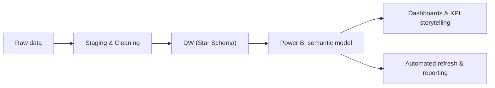

<!-- =========================
     Enrique Soares — Profile README
     ========================= -->

  

  
  

---

## 👋 About me
I’m a **Data Analyst / BI & Automation** with a background in **Electrical Engineering**.  
I build **dashboards, KPI reporting, and automation** that turn operational data into decisions.

- 🎯 Focus: Analytics + BI + Process optimization  
- 🧠 Studying: Higher Diploma in Data Analytics (2025–2026)  
- 🧩 I like: clean models, clear metrics, repeatable reporting  

---

## 🧰 Tech stack

  

  
  

---

## 📚 What I'm working on (college)
- 🧱 Data warehousing & dimensional modeling (star schema)  
- 🧮 SQL (constraints, joins, performance basics)  
- 🐍 Python (pandas, automation, data quality checks)  
- 📊 Power BI (Power Query, DAX, UX, storytelling)  

---

## 🗺️ Project architecture (figure)

---

## ⭐ Featured projects

- 🎮 **vgsales-data-project**  
  End-to-end analytics project with VG sales dataset  
  Repo: https://github.com/enriquebruno12/vgsales-data-project

---

## 🧩 Highlights (what I’ve built)

📈 AWS Goals Tracker: Power BI dashboard + automatic integration of partner metrics

🏭 Maintenance KPI Dashboard: weekly KPI dashboard for factory performance

⚡ Daily Route Check App: internal Power App to log electrical parameters for maintenance

---
## 📊 GitHub analytics

 
  
 
  

---
